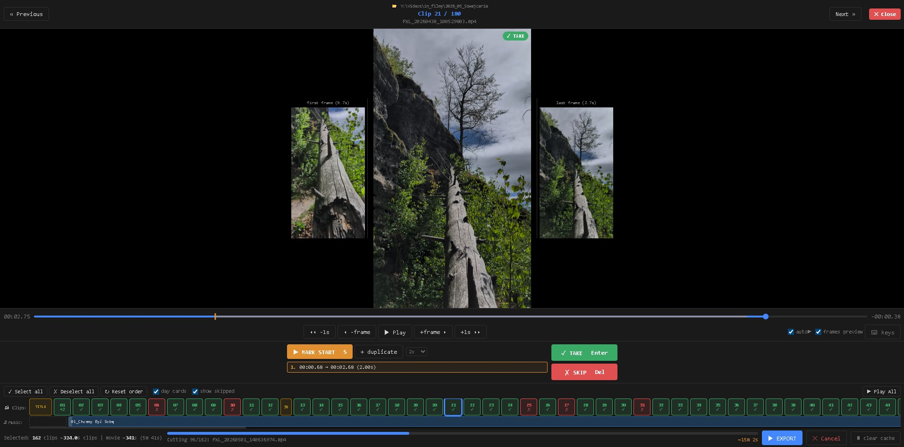

# Reelpicker



A local web application for quickly cutting vertical phone videos into a finished film.
Browse clips in the browser, mark fragments, arrange cards and music — click **Export** to get a
polished video with an intro, day-separator cards, background music, and a closing card.

## Requirements

- **Python 3.8+** — stdlib only, no `pip install`
- **FFmpeg** — `ffmpeg.exe` + `ffprobe.exe` placed next to `server.py`, **or** available in PATH
- **Browser** — Chrome, Edge, or Firefox

### Getting FFmpeg

Download a pre-built Windows binary from **[gyan.dev](https://www.gyan.dev/ffmpeg/builds/)**
(recommended: `ffmpeg-release-essentials.zip`).
Extract and copy `ffmpeg.exe` and `ffprobe.exe` next to `server.py`.

## Running

```bash
python server.py C:\path\to\folder\with\videos
```

The server starts at `http://localhost:8000` and opens the browser automatically.
The folder can also be entered in the UI after launching without an argument:

```bash
python server.py
```

## Folder structure

```
my_folder/
├── clip1.mp4
├── clip2.mp4
├── music/              ← optional: background music tracks
│   ├── 01_song.mp3
│   └── 02_song.mp3
├── selections.json     ← saved automatically (resume work anytime)
├── .clip_cache/        ← cached cut segments (speeds up re-exports)
├── .preview/           ← H.264 previews for HEVC clips (auto-generated)
└── output/             ← finished film goes here
    └── final_20260215_143022.mp4
```

## Workflow

### 1. Browse and decide

Clips are sorted chronologically by file modification date (with 5 AM day cutoff —
clips before 05:00 belong to the previous day).

For each clip choose one of three actions:

| Action | Key | Result |
|--------|-----|--------|
| **Take** | `Enter` | Include clip; advance to next |
| **Skip** | `Delete` | Exclude clip; advance to next |
| *(leave undecided)* | — | Include in export with default start time |

When a mark is set, playback stops automatically at `mark + clip_duration` so you can
evaluate the fragment without pausing manually.

### 2. Marking a fragment

- Press **S** to mark the current playback position as the clip's start.
- The clip is cut from that point for the configured **clip duration** (default 3 s,
  adjustable via the dropdown next to the duplicate button).
- Press **+ duplicate** to extract a second fragment from the same source clip at a
  different start time.
- **Double right-click** on the progress bar sets the mark so the fragment *ends* at the
  clicked position (`start = click − clip_duration`).

### 3. Keyboard shortcuts

| Key | Action |
|-----|--------|
| `Space` | Play / Pause |
| `S` | Mark current time as fragment start |
| `←` / `→` | Seek −1 / +1 second |
| `,` / `.` | Step −1 / +1 frame (30 fps) |
| `Enter` | Take clip and go to next |
| `Delete` | Skip clip and go to next |
| `PageUp` | Previous clip |
| `PageDown` | Next clip |
| `Esc` | Exit card-preview mode |

### 4. Queue

Below the player is the **clip queue** — one tile per selected fragment (plus card tiles).

- **Drag tiles** to reorder clips.
- **Click a clip tile** in the queue to jump to that clip in the player.
- Click **Reset order** to restore chronological order.
- The **Show skipped** checkbox reveals skipped clips in the queue (grey).
- **Select all** / **Deselect all** buttons for bulk operations.

### 5. Cards

Three types of card are inserted into the film automatically:

| Card | Duration | Notes |
|------|----------|-------|
| **Intro card** | 4 s | Title + subtitle; black background |
| **Day card** | 2 s | Date + day name (or custom text); one per day group |
| **End card** | 5 s | "The End" by default; editable |

**Editing cards:**
- **Click** a card tile in the queue → full-screen preview of the rendered card.
- **Double-click** a card tile → open the text editor modal (title + subtitle).
- Each day card can be **enabled/disabled** individually by clicking its tile in the queue
  (green = included, red = skipped). The master **Day cards** checkbox toggles all at once
  and shows an indeterminate state when some days are disabled.

### 6. Music

Place MP3/FLAC/WAV/AAC/OGG/M4A files in the `music/` subfolder.
They appear as coloured blocks in the **music bar** below the queue, scaled proportionally.

- **Drag the right handle** of a music block to trim where the track ends.
- **Drag the left handle** (offset spacer) to delay when the track starts in the film.
- Handles snap to clip boundaries for easy alignment.
- Multiple tracks are concatenated in alphabetical order and mixed with the clip audio.
- Music fades out over the last 10 seconds of the film (or less if the film is shorter).

### 7. Clip duration

The global **clip duration** (how many seconds each fragment is cut to) is set via the
dropdown near the **+ duplicate** button. Supported values: 0.5 s – 10 s.

Changing duration:
- Updates all timing displays (stats bar, music bar scale, frame previews) immediately.
- Is saved in `selections.json` and restored on next open.
- Invalidates the clip cache automatically (old cached segments are not reused).

### 8. Frame preview

Enable **frames preview** in the toolbar to show the **first frame** and **last frame** of
the current fragment side-by-side with the player. Useful for checking what actually ends
up in the export without playing the clip through.

### 9. Export

Click **▶ EXPORT** in the footer.

The generated film contains:

1. **Intro card** — title + subtitle, 4 seconds
2. **Day cards** *(optional)* — date + day name, 2 seconds each
3. **Selected fragments** — in queue order, each `clip_duration` seconds long
4. **End card** — "The End", 5 seconds
5. **Background music** — mixed with clip audio, trimmed and faded

Export progress and ETA are shown in real time. Press **✕ Cancel** to abort.

After export, the film is saved to `output/` and a Windows Explorer thumbnail is embedded.

Use **🗑 clear cache** to force full re-encoding on the next export (e.g. after changing
source files outside the app).

---

## Shot cache (`.clip_cache/`)

Each cut fragment is cached using a deterministic key:

```
{stem}_{source_mtime}_{start_ms}_{duration_ms}.mp4
```

The cache is automatically invalidated when:
- the source file changes (mtime)
- the fragment start time changes
- the clip duration changes
- the card text changes (title/day/end cards use a content MD5)

---

## GPU acceleration

The server auto-detects a hardware H.264 encoder at startup:

| GPU | Encoder | Quality flag |
|-----|---------|-------------|
| NVIDIA (Turing+) | `h264_nvenc` | `-cq` (VBR) |
| AMD | `h264_amf` | `-qp_i / -qp_p` |
| Intel | `h264_qsv` | `-global_quality` (ICQ) |
| *(none)* | `libx264` (CPU) | `-crf` |

The startup log shows the active encoder:

```
Video encoder: h264_nvenc
```

GPU encoding accelerates clip cutting, HEVC preview transcoding, and card generation.
Video filters (`drawtext`, `scale`, `colorspace`) always run on the CPU.

---

## HDR / HEVC support

### HEVC preview
Clips in HEVC (H.265) — e.g. newer iPhones, modern Android — don't play natively in browsers.
The server auto-generates H.264 previews in the background (`.preview/`). The UI is immediately
usable; each clip becomes playable as its preview finishes.

### HDR → SDR
If FFmpeg includes **libzimg** (`zscale`), the server applies Hable tone-mapping for HDR→SDR
during clip cutting. Without libzimg a colorspace-matrix fallback is used. Startup log:

```
HDR tone-mapping (zscale): yes
```

All output clips are H.264 High Profile, yuv420p, BT.709, limited range.

---

## Session guard

The server serves one active browser tab at a time. Opening a new tab displaces the previous
one ("Session lost" message appears). Reload any tab to reclaim the session.

---

## `selections.json` format

Saved automatically after every change. Resuming work is instant — just reopen the folder.

```json
{
  "source_folder": "C:\\videos\\may",
  "created": "2026-02-15T14:30:00",
  "clip_duration": 3.0,
  "title": "May Holiday 2026",
  "subtitle": "15-05-2026",
  "selections": [
    {"filename": "clip01.mp4", "start_time": 3.45, "enabled": true,  "extra_starts": []},
    {"filename": "clip02.mp4", "start_time": 0.0,  "enabled": true,  "extra_starts": [7.2]},
    {"filename": "clip03.mp4", "start_time": null,  "enabled": false, "extra_starts": []}
  ],
  "disabled_day_cards": ["2026-05-14"],
  "day_card_titles": {"2026-05-15": {"title": "Day 1", "subtitle": "Arrival"}},
  "end_card_title": "See you next time",
  "end_card_subtitle": "",
  "music_ends":    {"01_song.mp3": 142.5},
  "music_offsets": {"02_song.mp3": 28.0},
  "clip_order": ["clip02.mp4", "clip01.mp4", "clip03.mp4"]
}
```

---

## Export pipeline

```
[intro card 4s] + [day card 2s]? + [fragment Ns] × M + ... + [end card 5s]
        │
   concat (stream copy, no re-encode)
        │
   music mix (filter_complex: tracks → trim → offset → concat → amix → afade)
        │
   embed cover-art thumbnail
        │
   output/final_YYYYMMDD_HHmmss.mp4
```

All segments are normalised to 1080×1920, 30 fps, H.264, yuv420p, BT.709 — identical
parameters across segments allow lossless stream copy in the concat step.

---

## Server API

| Method | Path | Description |
|--------|------|-------------|
| `GET` | `/api/clips` | Clips list with metadata (codec, duration, size, HDR flag) |
| `GET` | `/api/selections` | Saved decisions + clip_duration + card titles |
| `GET` | `/api/music` | Music tracks from `music/` |
| `GET` | `/api/state` | Current folder, title, subtitle, end card text |
| `GET` | `/api/video/{filename}` | Stream source MP4 (Range requests supported) |
| `GET` | `/api/output/{filename}` | Download exported film |
| `GET` | `/api/frame/{filename}?t={s}` | Extract JPEG frame at time `t` |
| `GET` | `/api/title_thumbnail` | JPEG of intro card first frame |
| `GET` | `/api/export/status` | Export progress (status, %, message, output name) |
| `GET` | `/api/preview_status` | HEVC preview generation status per clip |
| `POST` | `/api/session` | Register session (single-client guard) |
| `POST` | `/api/folder` | Load folder, scan videos, apply defaults |
| `POST` | `/api/select` | Save decision for one clip |
| `POST` | `/api/settings` | Save intro card title + subtitle |
| `POST` | `/api/clip_duration` | Set global clip duration (0.5–10 s) |
| `POST` | `/api/clip_order` | Save custom clip order |
| `POST` | `/api/day_card_toggle` | Enable / disable a day card |
| `POST` | `/api/day_card_title` | Set custom text for a day card |
| `POST` | `/api/end_card_title` | Set end card title + subtitle |
| `POST` | `/api/music_ends` | Save track trim + offset values |
| `POST` | `/api/export` | Start export |
| `POST` | `/api/export/cancel` | Cancel running export |
| `POST` | `/api/clear-cache` | Delete `.clip_cache/` contents |
| `POST` | `/api/shutdown` | Gracefully stop the server |

---

## License

MIT
